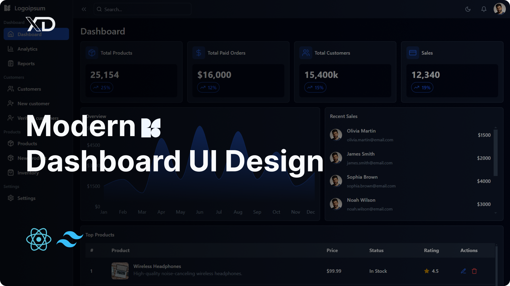

# Dashboard Pro

A modern, professional dashboard application built with React JS and TailwindCSS.

## Preview



## Features

-   **Responsive Design:** Ensures your dashboard looks great on desktops, tablets, and mobile devices.
-   **Clean and Modern Layout:** A professional design that highlights your data, analytics, and business metrics.
-   **Dark/Light Mode:** Support for both dark and light themes to match your preferences.
-   **Interactive Charts:** Dynamic data visualization using Recharts.
-   **Order Management:** Complete order tracking and management system.
-   **Real-time Analytics:** Monitor your business performance with real-time analytics.

## About

Welcome to the Dashboard Pro repository! This project is a comprehensive, professional dashboard interface designed for modern businesses. Whether you're managing orders, tracking analytics, or monitoring system performance, Dashboard Pro provides a clean, user-friendly, and fully responsive interface.

## 🗒️ Table of Contents

1. [💬 Introduction](#introduction)
2. [🛠️ Tools](#tools)
3. [✨ Features](#features)
4. [🚀 Getting Started](#getting-started)
5. [💻 Code Snippets](#code-snippets)
6. [☕ Support Me](#support-me)
7. [📦 Dependencies](#dependencies)
8. [🤝 Contributing](#contributing)
9. [📄 License](#license)

## <a name="introduction">💬 Introduction</a>

Welcome to the Dashboard UI Design repository! This project is a comprehensive guide to building a clean, user-friendly, and fully responsive dashboard interface. Whether you're new to UI/UX design or an experienced developer looking to enhance your skills, this repository provides essential resources to help you create an efficient and visually organized dashboard experience. Explore best practices for crafting intuitive layouts, managing data visualization, and ensuring seamless user interaction.

## <a name="tools">🛠️ Tools</a>

-   [React JS](https://react.dev)
-   [TailwindCSS](https://tailwindcss.com/)
-   [Lucide Icons](https://lucide.dev/)
-   [React Router](https://reactrouter.com/en/main)
-   [Recharts](https://recharts.org/en-US/)

## <a name="getting-started">🚀 Getting Started</a>

1. Clone the repository:
```bash
git clone <your-repository-url>
```

2. Install dependencies:
```bash
npm install
```

3. Start the development server:
```bash
npm run dev
```

## <a name="support-me">☕ Support Me</a>

[](https://ko-fi.com/J3J1NMYT7)

[](https://www.youtube.com/@_xdcode_ "XD Code")

## <a name="dependencies">📦 Dependencies</a>

-   [React](https://react.dev/)
-   [TailwindCSS](https://tailwindcss.com/)
-   [React Router](https://reactrouter.com/en/main)
-   [Recharts](https://recharts.org/en-US/)

## <a name="contributing">🤝 Contributing</a>

Contributions are welcome! Please feel free to submit a Pull Request.

## <a name="license">📄 License</a>

This project is licensed under the MIT License.
